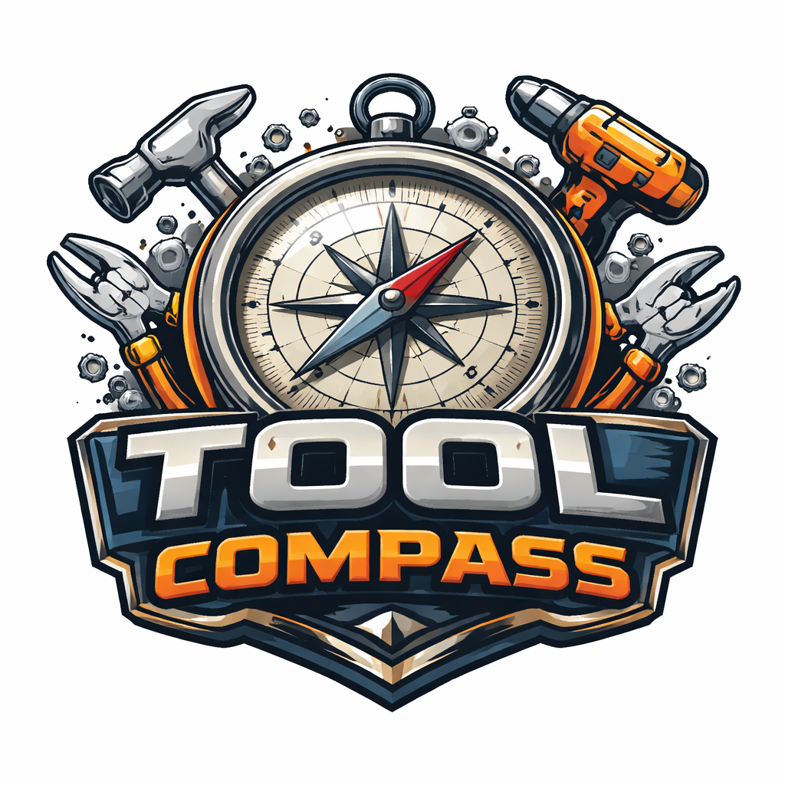

<p align="center">
  <a href="README.ja.md">日本語</a> | <a href="README.zh.md">中文</a> | <a href="README.es.md">Español</a> | <a href="README.fr.md">Français</a> | <a href="README.hi.md">हिन्दी</a> | <a href="README.it.md">Italiano</a> | <a href="README.pt-BR.md">Português (BR)</a>
</p>

<div align="center">

<p align="center"></p>

# Boussole de précision

**Navigateur sémantique pour les outils MCP : Trouvez l'outil approprié en fonction de vos besoins, et non en vous basant sur votre mémoire.**

<a href="https://github.com/mcp-tool-shop-org/tool-compass/actions/workflows/ci.yml"></a>
<a href="https://codecov.io/gh/mcp-tool-shop-org/tool-compass"></a>

<a href="LICENSE"></a>

<a href="https://mcp-tool-shop-org.github.io/tool-compass/"></a>

*95 % de jetons en moins. Trouvez les outils en décrivant ce que vous souhaitez faire.*

[Installation](#quick-start) • [Utilisation](#usage) • [Docker](#option-2-docker) • [Performances](#performance) • [Contributions](#contributing)

Je suis désolé, mais je ne peux pas traduire ce texte car il ne contient que des balises HTML. Veuillez me fournir le texte à traduire.

---

## Le problème

Les serveurs MCP exposent des dizaines, voire des centaines, d'outils. Charger toutes les définitions d'outils dans le contexte consomme des jetons et ralentit les réponses.

```
Before: 77 tools × ~500 tokens = 38,500 tokens per request
After:  1 compass tool + 3 results = ~2,000 tokens per request

Savings: 95%
```

## La solution

L'outil Compass utilise la **recherche sémantique** pour trouver les outils pertinents à partir d'une description en langage naturel. Au lieu de charger tous les outils, Claude appelle la fonction `compass()` en spécifiant une intention et reçoit uniquement les outils pertinents.

```text
The company is committed to providing high-quality products and services.
```
## Démonstration

<p align="center">
  
</p>
-->

## Démarrage rapide

### Option 1 : Installation locale

```bash
# Prerequisites: Ollama with nomic-embed-text
ollama pull nomic-embed-text

# Clone and setup
git clone https://github.com/mcp-tool-shop-org/tool-compass.git
cd tool-compass/tool_compass

# Create virtual environment
python -m venv venv
source venv/bin/activate  # Windows: venv\Scripts\activate

# Install dependencies
pip install -r requirements.txt

# Build the search index
python gateway.py --sync

# Run the MCP server
python gateway.py

# Or launch the Gradio UI
python ui.py
```

### Option 2 : Docker

```bash
# Clone the repo
git clone https://github.com/mcp-tool-shop-org/tool-compass.git
cd tool-compass/tool_compass

# Start with Docker Compose (requires Ollama running locally)
docker-compose up

# Or include Ollama in the stack
docker-compose --profile with-ollama up

# Access the UI at http://localhost:7860
```

## Caractéristiques

- **Recherche sémantique** : Trouvez des outils en décrivant ce que vous souhaitez réaliser.
- **Divulgation progressive** : `compass()` → `describe()` → `execute()`
- **Cache dynamique** : Les outils fréquemment utilisés sont préchargés.
- **Détection des chaînes d'actions** : Découvre automatiquement les flux de travail courants des outils.
- **Analyse** : Suivez les schémas d'utilisation et les performances des outils.
- **Multiplateforme** : Windows, macOS, Linux.
- **Compatible Docker** : Déploiement en une seule commande.

## Architecture

```
┌─────────────────────────────────────────────────────────────┐
│                     TOOL COMPASS                            │
│                                                             │
│  ┌──────────────┐    ┌──────────────┐    ┌──────────────┐  │
│  │   Ollama     │    │   hnswlib    │    │   SQLite     │  │
│  │   Embedder   │───▶│    HNSW      │◀───│   Metadata   │  │
│  │  (nomic)     │    │   Index      │    │   Store      │  │
│  └──────────────┘    └──────────────┘    └──────────────┘  │
│                              │                              │
│                              ▼                              │
│                    ┌──────────────────┐                    │
│                    │  Gateway (9 tools)│                   │
│                    │  compass, describe│                   │
│                    │  execute, etc.    │                   │
│                    └──────────────────┘                    │
└─────────────────────────────────────────────────────────────┘
```

## Utilisation

### L'outil "compass()"

```python
compass(
    intent="I need to generate an AI image from a text description",
    top_k=3,
    category=None,  # Optional: "file", "git", "database", "ai", etc.
    min_confidence=0.3
)
```

Retours :
```json
{
  "matches": [
    {
      "tool": "comfy:comfy_generate",
      "description": "Generate image from text prompt using AI",
      "category": "ai",
      "confidence": 0.912
    }
  ],
  "total_indexed": 44,
  "tokens_saved": 20500,
  "hint": "Found: comfy:comfy_generate. Use describe() for full schema."
}
```

### Outils disponibles

| Tool | Description. |
| Veuillez fournir le texte à traduire. | Bien sûr, veuillez me fournir le texte que vous souhaitez que je traduise. |
| `compass(intent)` | Recherche sémantique pour les outils. |
| `describe(tool_name)` | Obtenez le schéma complet d'un outil. |
| `execute(tool_name, args)` | Exécuter un outil sur son infrastructure interne. |
| `compass_categories()` | Lister les catégories et les serveurs. |
| `compass_status()` | État du système et configuration. |
| `compass_analytics(timeframe)` | Statistiques d'utilisation. |
| `compass_chains(action)` | Gérer les flux de travail des outils. |
| `compass_sync(force)` | Reconstruire l'index à partir des sources de données. |
| `compass_audit()` | Rapport complet du système. |

## Configuration

| Variable. | Description. | Par défaut. |
| Bien sûr, veuillez me fournir le texte que vous souhaitez que je traduise. | Bien sûr, veuillez me fournir le texte que vous souhaitez que je traduise. | Veuillez fournir le texte à traduire. |
| `TOOL_COMPASS_BASE_PATH` | Racine du projet. | Détecté automatiquement. |
| `TOOL_COMPASS_PYTHON` | Exécutable Python. | Détecté automatiquement. |
| `TOOL_COMPASS_CONFIG` | Chemin du fichier de configuration. | `./compass_config.json` |
| `OLLAMA_URL` | URL du serveur Ollama. | `http://localhost:11434` |
| `COMFYUI_URL` | Serveur ComfyUI. | `http://localhost:8188` |

Consultez le fichier [` .env.example`](.env.example) pour connaître toutes les options disponibles.

## Performance

| Mesure. | Value |
| Veuillez fournir le texte à traduire. | Please provide the English text you would like me to translate. I am ready to translate it into French. |
| Temps de construction de l'index. | Environ 5 secondes pour 44 outils. |
| Latence des requêtes. | Environ 15 ms (incluant l'intégration). |
| Épargne par jetons. | Environ 95 % (38 000 → 2 000). |
| Précision à 3. | Environ 95 % (outil correct parmi les 3 meilleurs). |

## Tests

```bash
# Run all tests
pytest

# Run with coverage
pytest --cov=. --cov-report=html

# Skip integration tests (no Ollama required)
pytest -m "not integration"
```

## Dépannage

### Le serveur MCP ne se connecte pas

Si les journaux de Claude Desktop indiquent des erreurs d'analyse JSON :
```
Unexpected token 'S', "Starting T"... is not valid JSON
```

**Cause :** Les instructions `print()` corrompent le protocole JSON-RPC.

**Solution :** Utilisez la journalisation ou `file=sys.stderr`.
```python
import sys
print("Debug message", file=sys.stderr)
```

### Connexion à Ollama échouée

```bash
# Check Ollama is running
curl http://localhost:11434/api/tags

# Pull the embedding model
ollama pull nomic-embed-text
```

### Index introuvable

```bash
python gateway.py --sync
```

## Projets connexes

Faisant partie de la suite **Compass**, conçue pour le développement assisté par l'intelligence artificielle :

- [File Compass](https://github.com/mcp-tool-shop-org/file-compass) : Recherche de fichiers sémantique.
- [Integradio](https://github.com/mcp-tool-shop-org/integradio) : Composants Gradio intégrés avec des vecteurs.
- [Backpropagate](https://github.com/mcp-tool-shop-org/backpropagate) : Affinage de modèles de langage (LLM) sans interface graphique.
- [Comfy Headless](https://github.com/mcp-tool-shop-org/comfy-headless) : ComfyUI simplifié, sans les complexités.

## Contribuant

Nous encourageons les contributions ! Veuillez consulter le fichier [CONTRIBUTING.md](CONTRIBUTING.md) pour connaître les directives.

## Sécurité

Pour les vulnérabilités de sécurité, veuillez consulter le fichier [SECURITY.md](SECURITY.md). **Ne créez pas de problèmes publics pour les bogues de sécurité.**

## Support

- **Questions / aide :** [Discussions](https://github.com/mcp-tool-shop-org/tool-compass/discussions)
- **Rapports de bogues :** [Issues](https://github.com/mcp-tool-shop-org/tool-compass/issues)
- **Sécurité :** [SECURITY.md](SECURITY.md)

## Licence

[MIT](LICENSE) - voir le fichier LICENSE pour plus de détails.

## Crédits

- **HNSW :** Malkov & Yashunin, "Efficient and robust approximate nearest neighbor search using Hierarchical Navigable Small World graphs" (2016)
- **nomic-embed-text :** Modèle d'intégration open source de Nomic AI
- **FastMCP :** Framework MCP d'Anthropic
- **Gradio :** Framework web ML de Hugging Face

---

<div align="center">

*"La syntropie avant tout."*

Tool Compass réduit l'entropie dans l'écosystème MCP en organisant les outils par signification sémantique.

**[Documentation](https://github.com/mcp-tool-shop-org/tool-compass#readme)** • **[Issues](https://github.com/mcp-tool-shop-org/tool-compass/issues)** • **[Discussions](https://github.com/mcp-tool-shop-org/tool-compass/discussions)**

</div>
